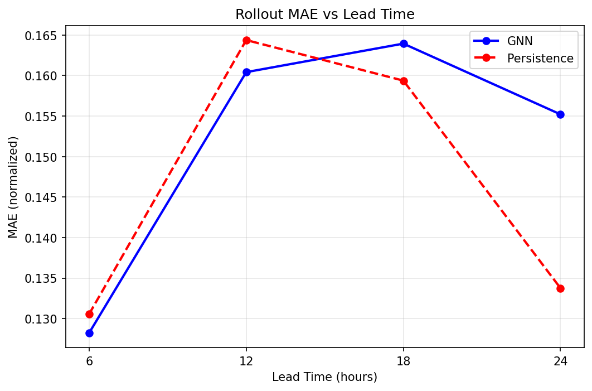
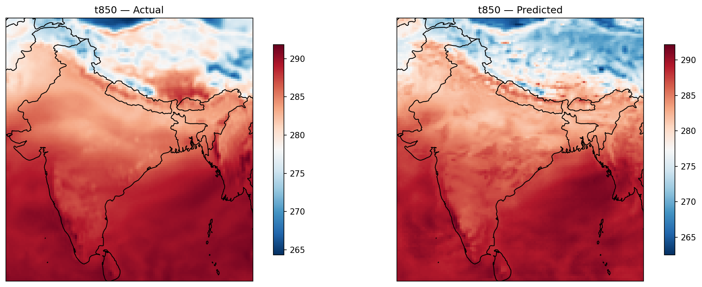
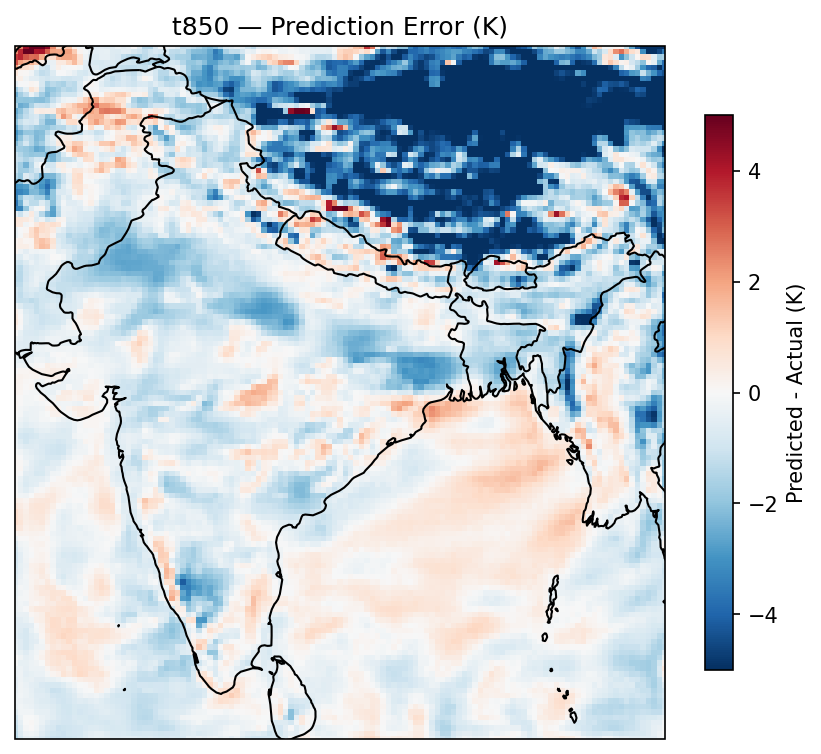
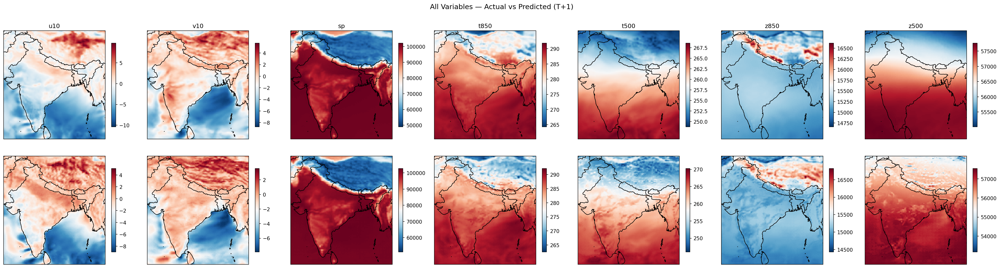

# GNN Weather Forecasting  India Regional

Graph neural network for short-range weather forecasting over India, built from scratch using ERA5 reanalysis data. Encode-process-decode architecture with autoregressive multistep training.

## Architecture

Encode-process-decode GNN with message passing layers.

- **Encoder**: linear projection from node features to hidden dimension
- **Processor**: N stacked message passing layers, each aggregating neighbor messages via scatter-add, concatenating with node features, and updating via MLP
- **Decoder**: linear projection back to feature dimension
- **Residual prediction**: model predicts the state delta (x_{t+1} - x_t) and adds it back to the input. Improves thermodynamic variable accuracy by focusing the model on small incremental changes rather than reconstructing the full atmospheric state.

| Hyperparameter | Value |
|---|---|
| hidden_dim | 128 |
| num_layers | 2 |
| k neighbors | 16 |
| edge features | distance + relative lat/lon |

## Data

ERA5 reanalysis downloaded via CDS API. India bounding box: 6-38N, 68-98E at 1 degree resolution, 6-hourly timesteps.

**Variables (7):** u10, v10, sp, t850, t500, z850, z500

**Split:**
- Train: 2019-2020 (2688 timesteps)
- Val: 2021 (1344 timesteps)
- Test: 2022 (1344 timesteps)

## Training

- **Loss**: MSE over K=4 autoregressive rollout steps (24 hours)
- **Optimizer**: Adam, lr=0.001
- **Scheduler**: ReduceLROnPlateau, patience=3, factor=0.5. Reduces LR when val loss plateaus, allowing the model to settle into finer minima in later epochs.
- **Gradient clipping**: max_norm=1.0. Stabilizes training through long rollouts by preventing exploding gradients.
- **Epochs**: 30
- **Best val loss**: 0.1218 (epoch 25)

Val loss plateaued around epoch 13-17, scheduler kicked in, and loss dropped from 0.136 to 0.121 by epoch 25.

## Results

### Per-variable MAE at T+1 (6h)

| Variable | MAE | Normalized MAE |
|---|---|---|
| u10 | 0.9887 m/s | 0.347 |
| v10 | 0.9256 m/s | 0.374 |
| sp | 426.96 Pa | 0.010 |
| t850 | 1.3953 K | 0.012 |
| t500 | 0.8269 K | 0.010 |
| z850 | 193.28 m²/s² | 0.026 |
| z500 | 317.31 m²/s² | 0.015 |

Thermodynamic variables (t850, t500, sp, z850, z500) achieve normalized MAE below 0.03. Wind components (u10, v10) are harder at ~0.35, consistent with the turbulent nature of near-surface winds.

### Rollout MAE vs Lead Time



GNN beats persistence at 6h and 12h. At 18h and 24h the model underperforms persistence, partly due to the diurnal cycle: the atmosphere at T+24 closely resembles T+0 (same time of day), making persistence artificially strong at 24h.

## Visualizations

### T850 Actual vs Predicted



The model captures the large-scale temperature structure: warm peninsula, cooler north, Himalayan cold signature. Predicted fields are slightly smoother than actual, typical of GNNs that tend to underestimate fine-scale variability.

### T850 Prediction Error



Largest errors are concentrated in the Himalayan and Tibetan Plateau region. The Himalayas act as an orographic barrier, blocking cold air from the north and creating a sharp temperature gradient along the mountain range. The model has no elevation features and cannot represent this, so it systematically overpredicts temperature in this region.

### All Variables Actual vs Predicted



## Error Analysis

**Himalayan orographic bias**: The largest systematic error is in the Himalayan/Tibetan Plateau region where the model overpredicts temperature by 3-5K. The KDTree graph construction uses only geographic distance with no terrain information. The model cannot learn that an 8000m mountain range blocks cold air advection from the north. Adding surface geopotential (orography) as a node feature would directly address this.

**Diurnal cycle at T+24**: The non-monotonic persistence baseline reflects the diurnal cycle. The atmosphere at the same time tomorrow looks very similar to today, making 24h persistence artificially competitive.

## Limitations and Future Work

- **Orographic features**: adding ERA5 surface geopotential as a node feature would improve Himalayan region accuracy
- **More pressure levels**: currently only 850hPa and 500hPa; adding 250hPa and 1000hPa would improve vertical representation
- **Larger graph connectivity**: k=16 neighbors at 1 degree resolution limits the effective receptive field; larger k or multi-scale graph would help capture longer-range teleconnections
- **Global scale**: this architecture directly motivated the GSoC 2026 Neural-LAM project, extending to global icosahedral graphs with proper spherical geometry

## How to Run

### Install dependencies
```bash
pip install torch numpy scipy pyyaml cdsapi cartopy matplotlib
```

### Download ERA5 data
```bash
python data/download_era5.py
```
Requires a CDS API key at `~/.cdsapirc`.

### Build graph
```bash
python data/build_graph.py
```

### Train
```bash
python training/train.py
```

### Inference
```bash
python training/inference.py
```

### Visualize
Open `visualize.ipynb` in the project root.

## Project Structure

```
gnn-weather-from-scratch/
├── data/
│   ├── download_era5.py
│   └── build_graph.py
├── model/
│   ├── gnn.py
│   └── message_passing.py
├── training/
│   ├── train.py
│   └── inference.py
├── plots/
├── visualize.ipynb
└── config.yaml
```
