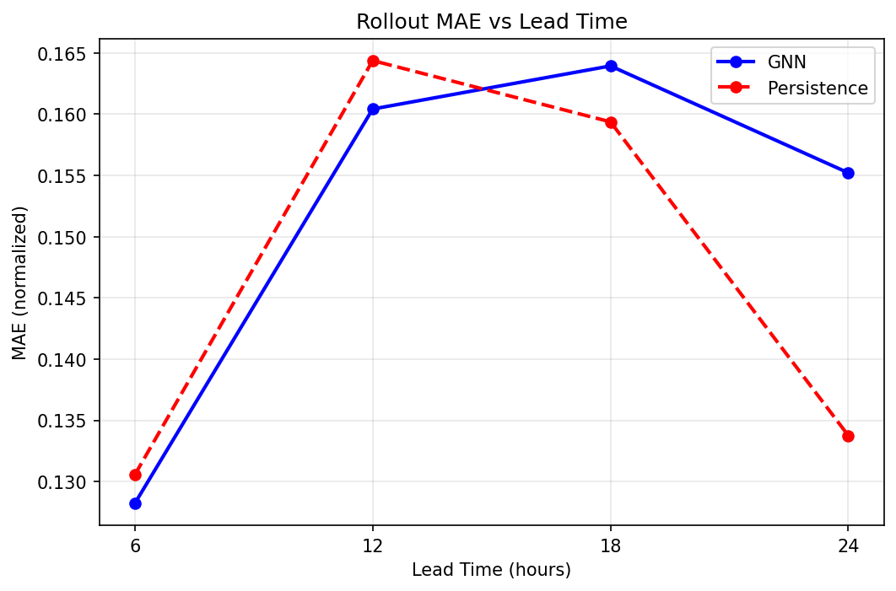
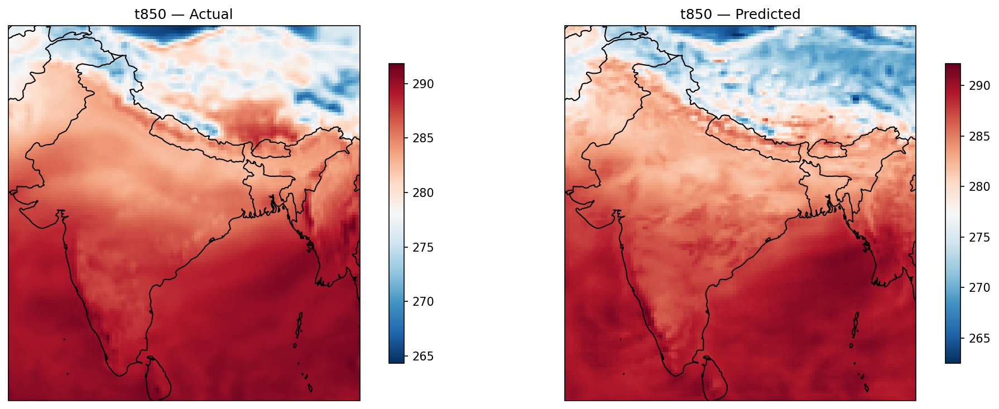
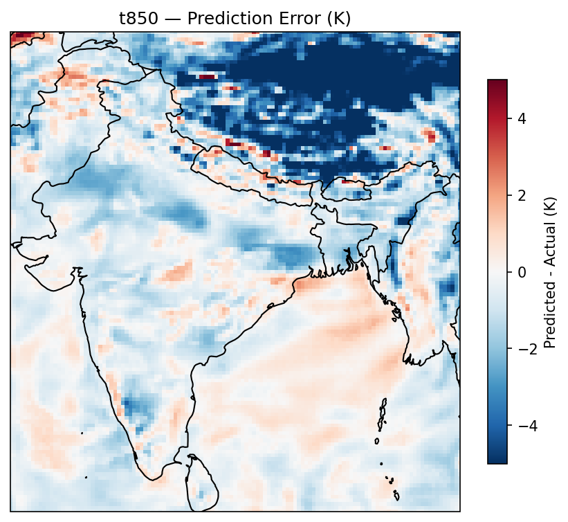

# GNN Weather Forecasting : LAM and Global

Graph neural network for short-range weather forecasting, built from scratch using ERA5 reanalysis data. Supports two domains via a single config switch: a regional LAM setup over India, and a global setup using a hierarchical icosahedral mesh. Encode-process-decode architecture with autoregressive training.

This repo is part of a unified demo ([neural-lam-demo](https://github.com/Joltsy10/neural-lam-demo)) built as GSoC 2026 preparation for [Neural-LAM Project 4](https://github.com/mllam/neural-lam). The global graph geometry is handled by the companion repo [neural-lam-global-mesh](https://github.com/Joltsy10/neural-lam-global-mesh).

---

## Architecture

### LAM (Flat GNN)

Encode-process-decode GNN with flat KNN graph over the regional grid.

- **Encoder**: linear projection from node features to hidden dimension
- **Processor**: N stacked message passing layers, each aggregating neighbor messages via scatter-add, concatenating with node features, and updating via MLP
- **Decoder**: linear projection back to feature dimension
- **Residual prediction**: model predicts state delta (x_{t+1} - x_t). Improves thermodynamic variable accuracy by focusing the model on small incremental changes rather than reconstructing the full atmospheric state.

### Global (Hierarchical GNN)

Encode-process-decode GNN with hierarchical icosahedral mesh. Implements the HiLAM architecture from [Oskarsson et al. (2024)](https://arxiv.org/abs/2309.17370).

- **G2M encoder**: message passing from ERA5 grid nodes to finest mesh level
- **Processor**: hierarchical up-down sweep through mesh levels
  - Up sweep (finest to coarsest): same-level pass then up pass at each level
  - Down sweep (coarsest to finest): down pass then same-level pass at each level
  - Separate learned weights per level and per pass type
- **M2G decoder**: message passing from finest mesh level back to grid nodes
- **Residual prediction**: same delta formulation as LAM
- **Positional encoding**: mesh node positions encoded as [sin(lat), cos(lat), sin(lon), cos(lon)] to handle spherical discontinuities
- **Layer normalization**: post-norm after each message passing layer for training stability
- **Residual connections**: skip connections inside each message passing layer for gradient flow

| Hyperparameter | LAM | Global |
|---|---|---|
| hidden_dim | 128 | 128 |
| num_layers | 2 | — |
| mesh_level | — | 2 (162 mesh nodes) |
| k neighbors | 16 | — |
| g2m_angle_deg | — | 7.5 |
| edge features | distance + relative lat/lon | great-circle length + tangential displacement |

---

## Data

ERA5 reanalysis downloaded via CDS API, 6-hourly timesteps at 1° resolution.

**Variables (7):** u10, v10, sp, t850, t500, z850, z500

**LAM domain:** India bounding box 6–38N, 68–98E (15,609 grid nodes)

**Global domain:** Full sphere 181×360 (65,160 grid nodes)

**Global split (10 years):**
- Train: 2010–2017 (11,688 timesteps)
- Val: 2018 (1,461 timesteps)
- Test: 2019 (1,461 timesteps)

**LAM split:**
- Train: 2019–2020 (2,688 timesteps)
- Val: 2021 (1,344 timesteps)
- Test: 2022 (1,344 timesteps)

---

## Training

- **Loss**: MSE over autoregressive rollout steps
- **Optimizer**: Adam, lr=0.001
- **Scheduler**: ReduceLROnPlateau, patience=3, factor=0.5
- **Gradient clipping**: max_norm=1.0
- **Gradient accumulation**: 16 steps (effective batch size)
- **Mixed precision**: bf16 autocast on CUDA
- **Epochs**: 30
- **Checkpointing**: epoch-level checkpoint saved locally and synced to GCS after every epoch for preemption recovery

---

## Infrastructure

### GCP Training Pipeline

Global training runs on Google Cloud Platform using the following setup:

**Data storage:** ERA5 data downloaded once to a public GCS bucket (`gs://era5-global-mesh-rayyan`) and shared across VMs. Storage cost is ~$0.50/month for 10 years at 1°.

**Data download VM:** `e2-standard-4` CPU-only VM (~$0.13/hr) used exclusively for CDS API downloads, uploading directly to GCS after each year to avoid local disk limits.

**Training VM:** NVIDIA L4 (24GB VRAM) on `g2-standard-4` for mesh 2 validation runs. A100 80GB or H100 80GB spot VMs planned for mesh 3 and 4.

**Checkpoint recovery:** Training script syncs `checkpoint_latest.pt` to GCS after every epoch. On preemption, the VM restarts and resumes from the last epoch automatically.

**Estimated costs (spot pricing):**
| Run | GPU | Est. time | Est. cost |
|---|---|---|---|
| Mesh 2, hidden 128, 10yr | L4 | ~2.5 hrs | ~$2 |
| Mesh 3, hidden 128, 10yr | H100 80GB | ~3-4 hrs | ~$8 |
| Mesh 4, hidden 128, 10yr | H100 80GB | ~20-24 hrs | ~$50 |

---

## LAM Results

### Per-variable MAE at T+1 (6h)

| Variable | MAE | Normalized MAE |
|---|---|---|
| u10 | 0.9887 m/s | 0.347 |
| v10 | 0.9256 m/s | 0.374 |
| sp | 426.96 Pa | 0.010 |
| t850 | 1.3953 K | 0.012 |
| t500 | 0.8269 K | 0.010 |
| z850 | 193.28 m²/s² | 0.026 |
| z500 | 317.31 m²/s² | 0.015 |

Thermodynamic variables achieve normalized MAE below 0.03. Wind components are harder at ~0.35, consistent with the turbulent nature of near-surface winds.

### Rollout MAE vs Lead Time



GNN beats persistence at 6h and 12h. At 24h the model underperforms persistence due to the diurnal cycle, the atmosphere at T+24 closely resembles T+0, making persistence artificially strong.

### T850 Actual vs Predicted



The model captures large-scale temperature structure: warm peninsula, cooler north, Himalayan cold signature. Predicted fields are slightly smoother than actual, typical of GNNs that underestimate fine-scale variability.

### T850 Prediction Error



Largest errors concentrated in the Himalayan and Tibetan Plateau region. The model has no elevation features and cannot represent the orographic barrier, systematically overpredicting temperature by 3–5K in this region.

---

## Global Results

### Mesh Level 2 : hidden_dim 128, 10 years (2010–2019)

Trained on full sphere ERA5 at 1° resolution (65,160 grid nodes), hierarchical icosahedral mesh at refinement level 2 (162 finest mesh nodes, 3 levels), 30 epochs, K=1 rollout, bf16 mixed precision, gradient accumulation 16 steps on NVIDIA L4.

#### Rollout MAE : Model vs Persistence

| Step | Hours | Model MAE | Persistence MAE | Skill |
|---|---|---|---|---|
| T+1 | 6h | 0.124950 | 0.152695 | +18.2% |
| T+2 | 12h | 0.182742 | 0.228226 | +19.9% |
| T+3 | 18h | 0.225902 | 0.285838 | +21.0% |
| T+4 | 24h | 0.260982 | 0.316000 | +17.4% |

Skill peaks at T+3 (18h) and degrades gracefully at T+4, consistent with the model learning multi-step temporal dynamics rather than single-step pattern matching.

#### Per-variable MAE at T+1 (6h)

| Variable | Model | Persistence | Unit |
|---|---|---|---|
| u10 | 0.6055 | 0.7400 | m/s |
| v10 | 0.5188 | 0.6340 | m/s |
| sp | 1098.60 | 1342.54 | Pa |
| t850 | 1.6077 | 1.9647 | K |
| t500 | 1.2521 | 1.5301 | K |
| z850 | 154.77 | 189.13 | m²/s² |
| z500 | 323.75 | 395.64 | m²/s² |

Model beats persistence on all 7 variables. Wind components show the largest absolute improvement; thermodynamic variables show smaller gains as they change more slowly over 6h.

#### Global Error Visualization

Interactive 3D globe with elevation-based error heatmap where nodes are displaced outward proportional to prediction error, colored by magnitude. Higher spikes indicate regions of larger forecast error.


Run `visualize_globe.ipynb` for the interactive version.

#### Notes

Refinement level 2 is a coarse mesh designed for rapid iteration; the processor operates on 12, 42, and 162 mesh nodes across the three levels. Accuracy is limited by mesh resolution rather than model capacity. Mesh level 3 and 4 runs are planned on H100 80GB and results will be added as they complete.

---

## Switching Domains

Set `domain: lam` or `domain: global` in `config.yaml`. Everything  is downstream so data loading, graph construction, model selection, all branch automatically.

```yaml
domain: global  # or lam

graph:
  k: 16                  # lam only
  mesh_level: 2          # global only
  g2m_angle_deg: 7.5     # global only

model:
  hidden_dim: 128
  num_layers: 2          # lam only
  node_dim: 7

data:
  train_end: 11688       # global: 8 years
  val_end: 13149         # global: 1 year val

training:
  num_epochs: 30
  lr: 0.001
  accum_steps: 16
  rollout_steps: 4
  gcs_checkpoint: gs://your-bucket/checkpoints/checkpoint_latest.pt
```

---

## How to Run

### Install dependencies
```bash
pip install torch numpy scipy pyyaml cdsapi xarray matplotlib plotly netcdf4
```

### Download ERA5 data
```bash
python data/download_era5.py
```
Requires a CDS API key at `~/.cdsapirc`. Downloads surface and pressure level files per year, uploading each to GCS immediately to avoid local disk limits.

### Build graph
```bash
python graph/build_graph.py
```
Processes data in 3 passes (mean, std, normalization) to stay within RAM limits for large datasets. LAM builds a flat KNN graph. Global calls the icosahedral bridge layer from [neural-lam-global-mesh](https://github.com/Joltsy10/neural-lam-global-mesh).

### Train
```bash
nohup python training/train.py > training.log 2>&1 &
```
Use `nohup` for long runs on cloud VMs so training continues after SSH disconnects. Resume from checkpoint automatically with `resume=True` (default).

### Inference
```bash
python training/inference.py
```

### Visualize (3D Globe)
```bash
jupyter notebook visualize_globe.ipynb
```

---

## Project Structure

```
gnn-weather-from-scratch/
├── data/
│   ├── download_era5.py       — CDS API download, per-year with GCS upload
│   ├── lam/                   — LAM ERA5 files + built graph .pt files
│   └── global/                — Global ERA5 files + built graph .pt files
├── graph/
│   └── build_graph.py         — Memory-efficient 3-pass graph construction
├── model/
│   ├── gnn.py                 — Flat GNN for LAM
│   ├── hi_gnn.py              — Hierarchical GNN for global (HiLAM-style)
│   └── message_passing.py     — MessagePassingLayer with residual + LayerNorm
├── training/
│   ├── train.py               — Training loop with bf16, grad accumulation, GCS checkpointing
│   ├── inference.py           — Rollout evaluation vs persistence baseline
│   └── baseline.py            — Persistence baseline
├── plots/
├── visualize_globe.ipynb      — Interactive 3D globe (Global)
└── config.yaml
```

---

## Relationship to Neural-LAM

The global hierarchical model here is a simplified standalone implementation of the architecture described in [Oskarsson et al. (2024)](https://arxiv.org/abs/2309.17370). The graph files produced by `build_graph.py` are in the exact format `utils.load_graph` expects in neural-lam, so the bridge to the full neural-lam codebase is direct.

